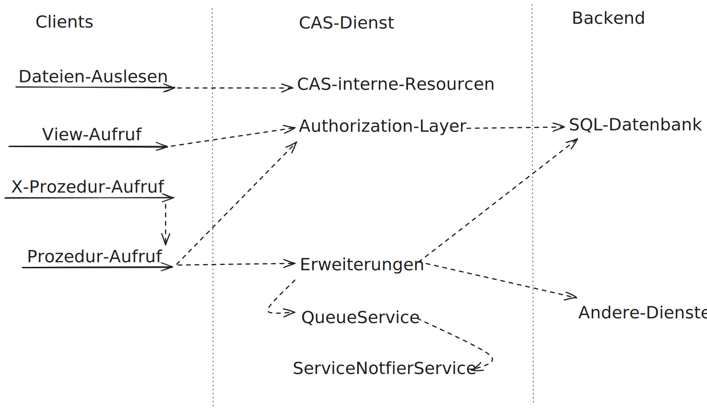

++++

++++

= CAS - Core Application System

++++

  
  
  

++++

== Architektur-Übersicht

== Beschreibung
Stellt eine einfache Schnittstelle zu Daten und Prozeduren einer SQL-Datenbank, Erweiterungen basierend auf Java, sowie einem Read-Only-Dateisystem bereit.
Der Fokus liegt hierbei darauf, das Backend und die Infrastruktur für Eclipse/link:https://github.com/minova-afis/aero.minova.rcp[WFC]-Anwendungen bereitzustellen.

Eine Illustration der Struktur wird xref:./doc/adoc/structure.adoc#[hier] bereitgestellt.

Für die alten Hasen unter uns: ein sehr großer Teil vom CAS stellt eine REST-Schnittstelle zu den SQL-Funktionalitäten vom Ncore und dem Install-Tool bereit.

== Status

Wir sind jetzt an einem Punkt angekommen,
wo Breaking-Changes bzgl. der REST-Schnittstelle und den Klassen `aero.minova.cas.[controller. *, service. *, servicenotifier. *, sql. *, CustomLogger]`
nicht erwünscht und so weit, wie sinnvoll möglich, vermieden werden.

Clients und Extensions sollen sich also darauf verlassen können,
dass die API möglichst stabil gehalten wird.

== Weiterführende Dokumentation

* xref:./doc/adoc/support.adoc#[Symptome, deren Ursachen und Lösungen]
* xref:./CHANGELOG.adoc#[Changelog]
* xref:./api/doc/adoc/index.adoc#[CAS API]
* xref:./service/doc/adoc/index.adoc#[CAS-Dienst]
* xref:./service/doc/adoc/installation.adoc#[Installation]
* xref:./service/doc/adoc/properties.adoc#[Property Übersicht]
* xref:./service/doc/adoc/extensions.adoc#[How to Extensions und App-Projekte]
* xref:./doc/adoc/projectStructure.adoc#[Projektstruktur]
* xref:./doc/adoc/structure.adoc#[Strukturübersicht]
* xref:./app/doc/adoc/table-index.adoc#[Tabellen-Index]
