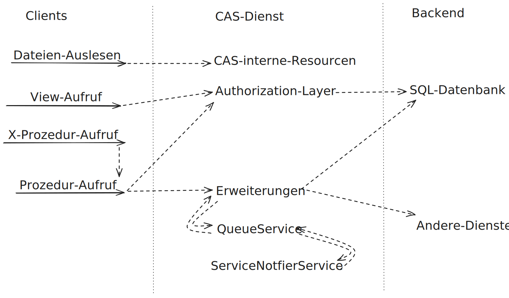
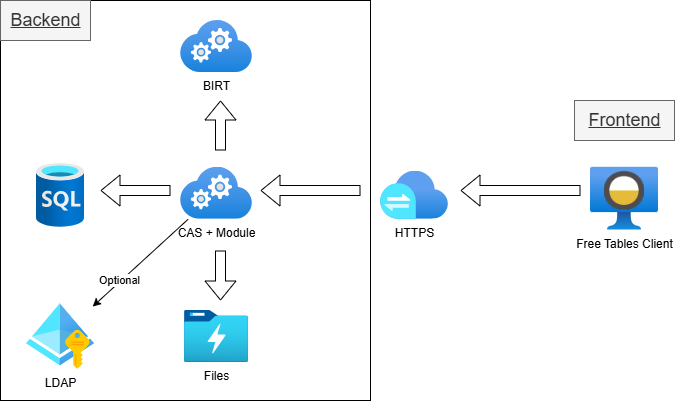

# CAS - Core Application System

  
  
  

# Architektur-Übersicht

<figure>

</figure>

# Beschreibung

Stellt eine einfache Schnittstelle zu Daten und Prozeduren einer SQL-Datenbank, Erweiterungen basierend auf Java, sowie einem Read-Only-Dateisystem bereit.
Der Fokus liegt hierbei darauf, das Backend und die Infrastruktur für Eclipse/[WFC](https://github.com/minova-afis/aero.minova.rcp)-Anwendungen bereitzustellen.

Eine Illustration der Struktur wird [hier](./doc/adoc/structure.adoc) bereitgestellt.

Für die alten Hasen unter uns: ein sehr großer Teil vom CAS stellt eine REST-Schnittstelle zu den SQL-Funktionalitäten vom Ncore und dem Install-Tool bereit.

# µCAS

Seit November 2025 gibt es eine allgemeine Micro-CAS Version, die auf jedem Bestandssystem installiert werden kann, um eine REST-Schnittstelle für DB Operationen bereitstellt und Applikationsdateien (Forms, Übersetzungen, Bilder) direkt aus der Datenbank bezieht und diese ebenfalls über REST liefert. [Weitere Infos](https://github.com/minova-afis/aero.minova.cas/tree/main/mcas)

# Status

Wir sind jetzt an einem Punkt angekommen,
wo Breaking-Changes bzgl. der REST-Schnittstelle und den Klassen `aero.minova.cas.[controller. *, service. *, servicenotifier. *, sql. *, CustomLogger]`
nicht erwünscht und so weit, wie sinnvoll möglich, vermieden werden.

Clients und Extensions sollen sich also darauf verlassen können,
dass die API möglichst stabil gehalten wird.

# Weiterführende Dokumentation

-   [Symptome, deren Ursachen und Lösungen](./doc/adoc/support.adoc)

-   [Konzept von Free Tables für das Freistellungsportal](./doc/docx/konzept-von-free-tables-fuer-das-freistellungsportal.docx) ([PDF](./doc/pdf/konzept-von-free-tables-fuer-das-freistellungsportal.pdf))

-   [Changelog](./CHANGELOG.md)

-   [CAS API](./api/doc/adoc/index.adoc)

-   [CAS-Dienst](./service/doc/adoc/index.adoc)

-   [Installation](./service/doc/adoc/installation.adoc)

-   [Property Übersicht](./service/doc/adoc/properties.adoc)

-   [How to Extensions und App-Projekte](./service/doc/adoc/extensions.adoc)

-   [Projektstruktur](./doc/adoc/projectStructure.adoc)

-   [µCas](https://github.com/minova-afis/aero.minova.cas/tree/main/mcas)

-   [Tabellen-Index](./app/doc/adoc/table-index.adoc)
