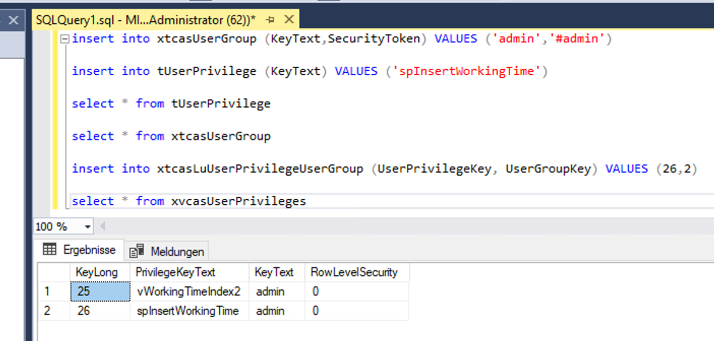

== Manuelles Hinzufügen von Rechten

[source::sql]
----
insert into xtcasUserGroup (KeyText,SecurityToken) VALUES ('admin','#admin')

insert into tUserPrivilege (KeyText) VALUES ('vWorkingTimeIndex2')
----

Nachdem man die Gruppe in xtcasUserGroup angelegt hat,
muss in tUserPrivilege das gewünschte Recht ebenfalls angelegt werden, falls es noch nicht vorhanden ist.
 
[source::sql]
----

insert into xtcasLuUserPrivilegeUserGroup (UserPrivilegeKey, UserGroupKey) VALUES (25,2)

select * from xvcasUserPrivileges

----

Für den Eintrag im xtcasLuUserPrivilegeUserGroup werden dann die KeyLongs vom gewünschten Recht(UserPrivilegeKey) und der Gruppe(UserGroupKey) benötigt. 

.Diese SQL-Query generiert die xtcasLuUserPrivilegeUserGroup-Query für alle (UserPrivilegeKey, UserGroupKey)-Kombinationen, welche noch nicht vorhanden sind. Es ist sinnvoll, diese zu verwenden, wenn viele Privilegien auf einmal freigeschalten werden sollen.
[source::sql]
----

select 'insert into xtcasLuUserPrivilegeUserGroup (UserPrivilegeKey, UserGroupKey) VALUES ('+cast(tu.KeyLong as nvarchar)+',1)'
from tUserPrivilege tu
left join xtcasLuUserPrivilegeUserGroup x on x.UserPrivilegeKey = tu.KeyLong
where x.KeyLong is null

----

Die Ausgabe der Query kann einfach in den SQL-Editor kopiert und dann ausgeführt werden.