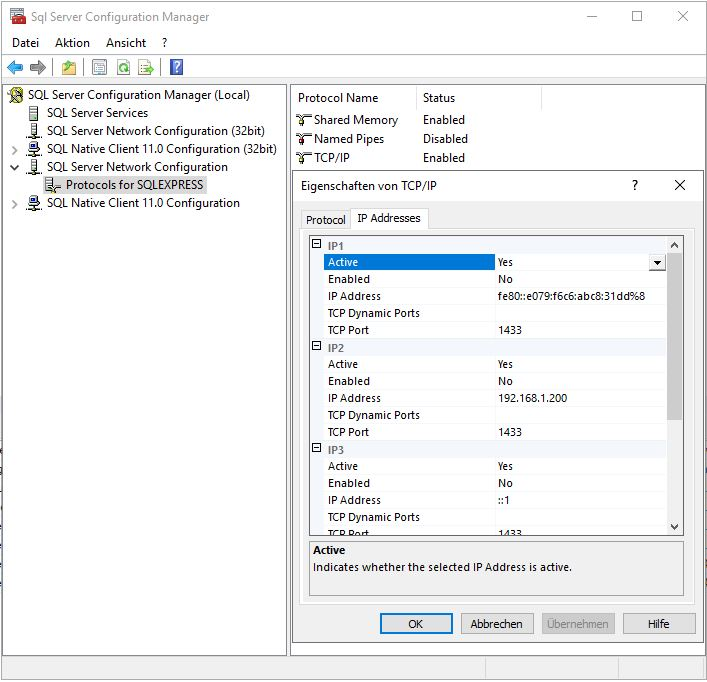

= Installation

== SQL-Server und Datenbank einrichten.
* SQL-Server installieren.
* Datenbank erstellen.
* SQL-Benutzer und SQL-Anmeldung für Datenbank einrichten.
* `Connection.xbs` mit SIS(name="servicesinvoicingsystem") als Application erstellen.
* TCP-Verbindungen für SQL-Server freischalten.

* Anmeldung testen.
* xref:./aero.minova.core.application.system.service/doc/adoc/init.adoc#[Tabellen und Prozeduren] aufspielen.

== CAS-Dienst installieren.

* Dienst-Ordner erstellen (bspw. `Shared Data\Program Files\cas`).
* `application.properties` im Dienst-Ordner erstellen:

[source]
.Minimal-Vorlage
--------
aero_minova_core_application_root_path=<Pfad zum Kundensystem>/Shared Data/Program Files/SIS
aero_minova_database_url=<URL aus der Connection.xbs ohne Benutzername und Passwort>
aero_minova_database_user_name=<SQL-Benutzer aus der Connection.xbs>
aero_minova_database_user_password=<Passwort aus der Connection.xbs>

login_dataSource=<database|admin|ldap>
--------

=== Optional Keystore für HTTPS einrichten.

[source]
.Keystore-Einstellungen
----
server.ssl.key-store-type=<Typ des Keystores>
server.ssl.key-store=<Pfad zum Keystore>
server.ssl.key-alias=<Alias im Keystore>
server.ssl.key-store-password=<Passwort des Keystores>
----

=== lib-Ordner erstellen.

** Release verwenden: Die Release Jars aus einem Docker-Image kopieren.
** Entwickler-Version verwenden:
CAS-Dienst mit `mvn clean verify` bauen.
`target/libs/*` in den lib Ordner kopieren.
`target/aero.minova.core.application.system.service.jar.original` kopieren und `original` Suffix entfernen.

* Windows-Dienst erstellen:
** Letzten stabilen Release der Wrapper-Exe kopieren: https://github.com/winsw/winsw/releases
** Die Exe in den Dienst Ordner kopieren und passend umbennen.
** XML-Konfigurations-Datei für den Wrapper erstellen.
Der Prefix der Konfigurations-Datei muss mit der Wrapper-Exe übereinstimmen.
Beispiel: `com.minova.vgeibelstadt.cas.exe` und `com.minova.vgeibelstadt.cas.xml`

[source,xml]
--------
<?xml version="1.0" encoding="UTF-8"?>
<service>
	<id>ID des Windows-Dienstes ohne Leerzeichen</id>
	<name>Name des Windows-Dienstes</name>
	<description>Beschreibung des Windows-Dienstes</description>
	<executable>Pfad zum verwendeten java</executable>
	<!-- Nur eines der beiden Argumente verwenden. -->
	<!-- Die erste Variante ist für den Fall, dass die Release-Version verwendet wird. -->
	<arguments>-Dloader.path="lib/" -jar aero.minova.core.application.system.service.jar</arguments>
	<!-- Die zweite Variante ist für den Fall, dass die Entwickler-Version verwendet wird. -->
	<arguments>-cp "lib/*" aero.minova.core.application.system.CoreApplicationSystemApplication</arguments>
	<logmode>rotate</logmode>
</service>
--------

Wenn alles bereit steht,
kann der Windows-Dienst über die CMD (mit unter Umständen Admin-Rechten) installiert werden: `<exe> install`.
Für das vorherige Beispiel würde es `com.minova.vgeibelstadt.cas.exe install` lauten.
