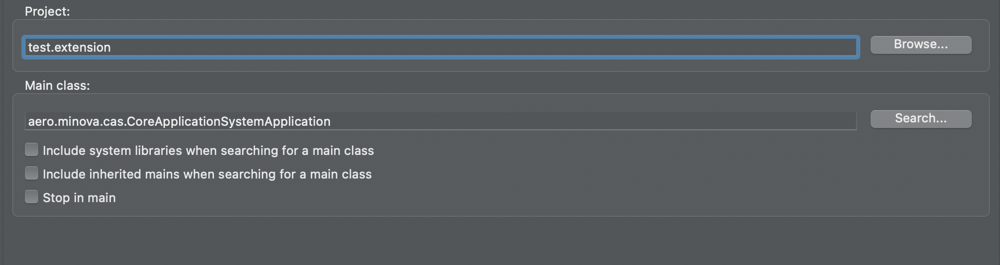
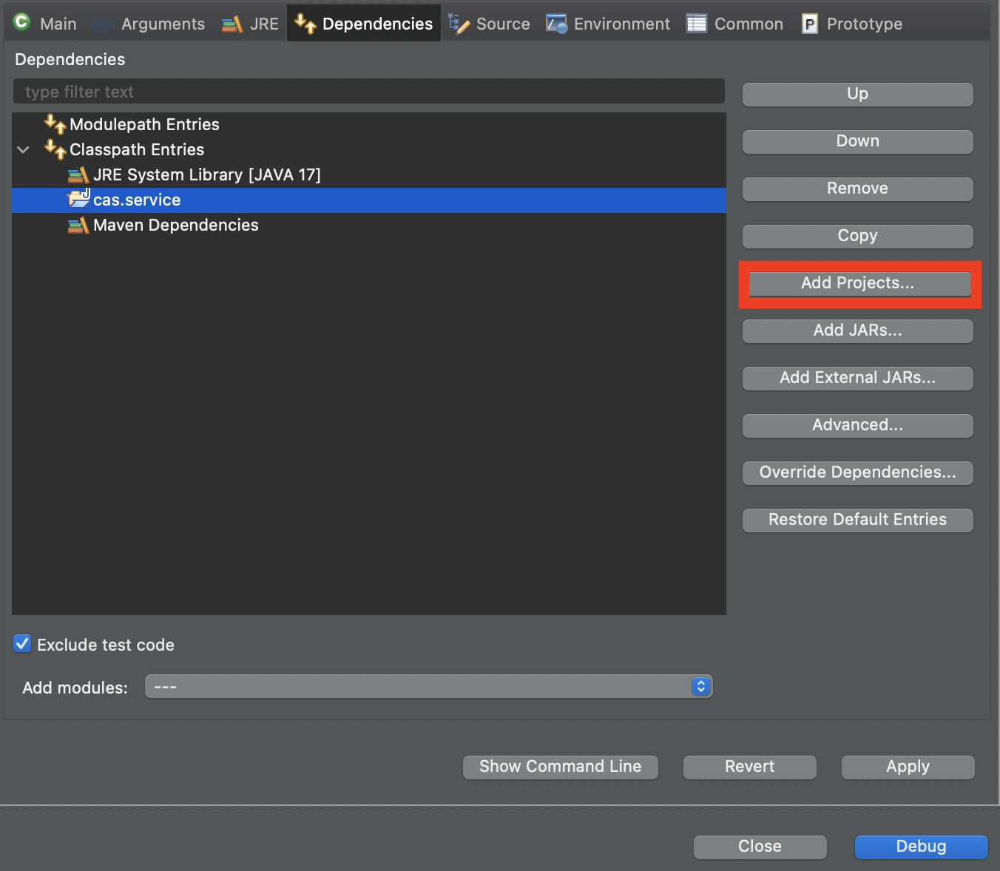

= Extensions bzw. Erweiterungen

Es können beim CAS Erweiterungen, sowohl für Prozeduren, als auch für Views und ganze Transaktionen registiert werden.
Wenn eine Prozedur oder View aufgerufen wird, wird im CAS geprüft, ob es eine passende Erweiterung dazu gibt.
Ist dies der Fall wird diese aufgerufen, anstatt den SQL-Server zu befragen.

Es reicht in der Regel nicht, wenn die Erweiterung im Klassenpfad ist,
da diese beim Prozedur oder View-Aufruf sonst nicht aktiv sind.
Es muss beim entsprechenden Controller die registerExtension()-Methode innerhalb der Extension aufgerufen werden.

== Zweck von Erweiterungen

Erweiterungen erlauben es zusätzliche Funktionalitäten zum CAS hinzuzufügen.
Erweiterungen sind nicht dazu da, sämtliche Funktionalitäten des Gesamtsystems in den CAS-Dienst einzubauen.
Folgendes sind legitime Einsatzzwecke:

* SQL mit JPA-Code ersetzen, wobei große Funktionalitäten, wie die Bestandsaufnahme (`aero.minova.stock.service`),
  in eigene Dienste gesteckt werden sollen.
* Nachrichten an andere Dienste schicken, wenn bestimmte Anfragen an das CAS kommen.
* Ein vorläufiger Ersatz um kleine Jobs und Ähnliches umzusetzen.

== Aufbau von Erweiterungen

Alle Abhängigkeiten von Erweiterungen müssen den scope provided haben.
Diese Abhängigkeiten stehen somit während des Bauens zur Verfügung,
werden aber beim Deployment durch das CAS bereitgestellt.
Als Abhängigkeit sind für Erweiterungen nur das CAS und andere CAS-Erweiterungen erlaubt.

Erweiterungen dürfen keine eigene Abhängigkeit (Jars) mitbringen,
da dies zu Versionen-Konflikten führen wird
(dieselbe Jar ist in den Lib-Ordner des CAS-Dienstes in unterschiedlichen Version mehrmals vorhanden).

Somit stellt das CAS alle Abhängigkeiten wie JPA und ähnliches zur Verfügung.
Fehlt eine Abhängigkeit, muss diese in den CAS-Dienst selber mit eingebaut werden.
Allerdings, ist es eine Einzelfall-Entscheidung, ob diese zusätzliche Abhängigkeit übernommen wird oder nicht.
Damit wird verhindert, dass das CAS unnötig aufgebläht wird.

```xml
<project xmlns="http://maven.apache.org/POM/4.0.0" xmlns:xsi="http://www.w3.org/2001/XMLSchema-instance" xsi:schemaLocation="http://maven.apache.org/POM/4.0.0 https://maven.apache.org/xsd/maven-4.0.0.xsd">
  <modelVersion>4.0.0</modelVersion>
    <groupId>aero.minova</groupId>
    <artifactId>cas.job.email</artifactId>
    <version>12.4.9-SNAPSHOT</version>
    <parent>
        <groupId>aero.minova</groupId>
        <artifactId>spring.maven.root</artifactId>
        <version>1.4.3</version>
        <relativePath/>
    </parent>
	<properties>
		<maven.compiler.source>17</maven.compiler.source>
		<maven.compiler.target>17</maven.compiler.target>
	</properties>
	<dependencies>
		<dependency>
			<groupId>aero.minova</groupId>
			<artifactId>cas.service</artifactId>
			<version>12.57.0</version>
			<scope>provided</scope>
		</dependency>
	</dependencies>
	<scm>
		<connection>scm:git:https://github.com/minova-afis/aero.minova.cas.job.email</connection>
		<developerConnection>scm:git:https://github.com/minova-afis/aero.minova.cas.job.email</developerConnection>
		<tag>HEAD</tag>
	</scm>
</project>
```

== Erweiterungs-Registierung

Hierzu muss bei dem jeweiligen Controller nur die Methode *'registerExtension'* aufgerufen werden. 
Hierbei muss darauf geachtet werden, dass keine zwei Extensions mit demselben Namen exisiteren. 
In diesem Fall wird eine entsprechenede Exception geworfen.

Alle registierten Erweiterungen werden beim 'Setup' automatisch als Recht mit installiert und können so einfacher an die Rollen vergeben werden.
Denn bevor eine Extension ausgeführt wird, werden die Rollen des Nutzers, der die Anfrage stellt, erst einmal darauf überprüft,
ob das entsprechende Recht für die Extension vorhanden ist.


== Step by step - Anleitung

Falls das link:https://github.com/minova-afis/aero.minova.default.template.app[Template-Projekt] vernwendet wird, können Schritt 1 und 2 übersprungen werden.

1. Eine Extension wird in den Maven-Unterprojekt 'extension' erstellt. 

2. In der POM des *app*-Projektes ist folgendes Plugin erforderlich:

----
<plugins>
	<plugin>
		<artifactId>maven-resources-plugin</artifactId>
		<version>3.3.0</version>
		<executions>
			<execution>
				<id>copy-extensions</id>
				<phase>generate-resources</phase>
				<goals>
					<goal>copy-resources</goal>
				</goals>
				<configuration>
					<outputDirectory>${project.build.directory}/extensions</outputDirectory>
					<resources>
						<resource>
							<directory>${project.build.directory}/../../extension/target</directory>
							<includes>
								<include>*.jar</include>
							</includes>
							<excludes>
								<exclude>*sources.jar</exclude>
							</excludes>
						</resource>
					</resources>
				</configuration>
			</execution>
		</executions>
	</plugin>
</plugins>	
----

Durch das Hinzufügen dieses Plugins, wird beim Bauen des gesamten Projektes die Jar der Extension bereits in das richtige Verzeichnis geschoben. 
Weitere Abhängigkeiten sollen **NICHT** mit in den extensions-Ordner kopiert werden. 
Die einzige Ausnahme ist, wenn eine Abhängigkeit benötigt wird, die nicht vom CAS bereitgestellt wird. 
Das sollte aber nur selten vorkommen.
In diesem Fall soll auch nur genau die entsprechende Jar kopiert werden.

Benötigt eine Extension eine Abhängigkeit auf eine andere Extension, so muss diese dependency sowohl in die extension.pom (damit die Extension gebaut werden kann) als auch in die app.pom (damit die entsprechende jar mitausgeliefert wird) eingetragen werden! 
Hier muss darauf geachtet werden, dass die gleichen Versionen genutzt werden.
Ausgeliefert wird, was in der app.pom steht.

3. Controller-Klasse im src/main/java des extension-Projektes erstellen und dort je nach Bedarf den SQLViewController, den XSqlProcedureController und/oder den SqlProcedureController eintragen. Hier das @Autowired nicht vergessen.

4. Eine Setup-Methode erstellen, welche mit der @PostConstruct-Annotation gekennziechet ist. Diese muss die *'registerExtension'*-Methode des vorher importierten Controllers aufrufen und damit die Extension mit dem dazugehörigen Keyword registrieren. 

5. Wenn in einer Extension etwas geloggt werden muss, wird dies über den CustomLogger gemacht. Welche Methode des Loggers für welchen Fall verwendet werden müssen, wird xref:./logs.adoc#[hier] erklärt. 

Die Klasse sollte am Ende ungefähr so aussehen:
----
import org.springframework.web.bind.annotation.RestController;

import aero.minova.cas.CustomLogger;
import aero.minova.cas.controller.SqlProcedureController;
import aero.minova.cas.controller.SqlViewController;

@RestController
public class ExampleController {

	@Autowired
	SqlProcedureController sqlProcedureController;
	
	@Autowired
	XSqlProcedureController xsqlProcedureController;

	@Autowired
	SqlViewController sqlViewController;

	@Autowired
	CustomLogger customLogger;

	@PostConstruct
	public void setup() {
		// fügt Extension hinzu
		sqlProcedureController.registerExtension("xpcasBeispiel", this::doSomething);
	}

	private ResponseEntity<SqlProcedureResult> doSomething(Table inputTable) {
		customLogger.logUserRequest("Hier wird etwas gemacht!");
		return ResponseEntity//
				.ok()//
				.contentType(MediaType.APPLICATION_JSON)//
				.body(new SqlProcedureResult());
	}

----

== Besonderheiten

* Die Extensions sind selbst dafür verwantwortlich, im Fehlerfall Rollbacks durchzuführen.
* Gibt eine Extension null zurück, so wird die Prozedur/Transaktion zusätzlich als SQL ausgeführt

== How to Debug

Wenn man eine Extension debuggen möchte, muss die Konfiguration in Eclipse folgendermaßen erstellt werden:

1. Auf die Main-Klasse (CoreApplicationSystemApplication.java) im dem CAS-Projekt rechtsklick -> Run As/Debug As -> Java Application. 
Warten bis sich etwas in der Console tut und dann direkt abbrechen. 
Falls für das CAS bereits eine Debug Configuration existiert, kann dies einfach kopiert werden.

2. In die gerade erstellte Debug-Configuration gehen (In der Taskleiste neben dem grünen Käfer auf den Pfeil nach unten klicken, das Drop-Down-Menü öffnen und dann ganz unten "Debug Configurations...") und dort als Projekt den Namen der zu debuggenden Extension eintragen, siehe Abbildung. 



3. In den Dependencies-Tab wechseln, dort auf "Add Projects ..." klicken und das extension-Projekt hinzufügen.



Jetzt kann gedebugged werden. 
