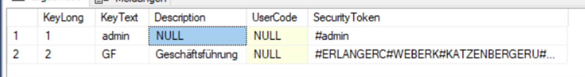

== Sicherheitsmechanismen

=== Anforderungen an den Betrieb

Es wird standardmäßig HTTP und Basic Authentication verwendet.
Der Zugriff auf das CAS *muss* über ein Proxy erfolgen,
welches den Traffic entsprechend verschlüsselt.
Zudem sollten keine weiteren Teilnehmer Zugriff auf das Netzwerk vom CAS haben.
 
=== SecurityToken

Jeder User erhält beim Login eine Reihe an SecurityToken.
Neben den SecurityTokens, welche aus dem Active Directory dem User bereits zugeordnet wurden,
erhält er zudem die SecurityTokens der Gruppen, in welche er sich befindet und einen einzigartigen SecurityToken. 

Der User mitsamt seines Usernames, seinem spezifischen SecurityToken und 
seinen GruppenSecurityTokens(Memberships) ist in der Tabelle xtcasUser hinterlegt.

[source, sql]
----
select KeyLong,KeyText,UserSecurityToken,Memberships from xtcasUser
----

* *KeyText*: der Name des Users
* *UserSecurityToken*: der eindeutige SecurityToken des Users. Hier wird der Keytext aus der Tabelle tEmployee verwendet!
* *Memberships*: ein String an SecurityToken, welche mit " #" voneinander getrennt sind. 
Dieser String beinhaltet sowohl den UserSecurityToken, als auch die GroupSecurityToken

.Gewöhnlicher Eintrag für User ohne spezielle Rechte
image::images/xtcasuser-example.png[]

Falls kein Eintrag für den eingeloggten User in der Tabelle xtcasUser existiert, gilt sein UserSecurityToken als einer der SecurityTokens.

Die Gruppen aus dem Active Directory des Users zählen ebenfalls zu den Memberships und werden in jedem Fall auch gegen die Datenbank abgefragt.

Anhand der Memberships erhält man über die Tabelle xtcasUserGroups die Memberships(SecurityToken) der Gruppen, welche 
die UserSecurityToken der User enthalten, dessen Spalten der eingeloggte User sehen darf.

[source, sql]
----
select KeyText,SecurityToken from xtcasUserGroup
----

* *KeyText* der Name der UserGroup, welche in den Memberships des Users enthalten ist
* *SecurityToken* die SecurityToken der User, mithilfe die Mitglieder der Gruppe bestimmte Spalten sehen dürfen. Diese Tokens sind ebenfalls mit " #" voneinander getrennt.

.Eintrag für Gruppen mit speziellen Rechten

=== Tabellenzugriffserlaubnis

Bei jedem Aufruf der Methode _getIndexView(Table_ _inputTable)_ wird auf der View xvcasUserSecurity nach den nötigen Berechtigungen gesucht.
Dies geschieht mit der Methode _checkPrivilege(Table_ _inputTable)_ in folgender Form:

[source, sql]
----
select PrivilegeKeyText,KeyText,RowLevelSecurity from xvcasUserSecurity
where (PrivilegeKeyText = 'inputTable.getName()' and KeyText='admin')
or    (PrivilegeKeyText = 'inputTable.getName()' and KeyText='verwaltung')
or    ...
----

* *PrivilegeKeyText*: der Name der Tabelle, auf welche der User zugreifen möchte
* *KeyText*: eine der Rollen des Users
* *RowLevelSecurity*: ein Bit, welches darauf hinweist, ob diese Rolle auf der angefragten Tabelle nur bestimmte Zeilen sehen darf; siehe <<Row-Level-Security>>

Diese Liste an Tripeln wird dann an die dafür vorgesehenen Methoden weiter gereicht. 

=== Row-Level-Security

Da jeder User eine ganze Reihe von SecurityToken hat, wird am Ende eines Selects
eine WHERE-Bedingung hinzugefügt, welche auf die vorhandenen SecurityToken abfragt.
Anhand der Liste an Tripeln, welche zu Beginn der SQL-Abfrage erstellt wurde, siehe <<Tabellenzugriffserlaubnis>>, wird untersucht, ob eine der Rollen ein Bit mit dem Wert *false* enthält.
Falls dies zutrifft, darf der User alle Einträge der Tabelle sehen, wenn nicht, darf er nur die Spalten sehen, zu welchen er den passenden SecurityToken hat. 

[source, sql]
----
select [...] from vBeispielView
where [...]
and ( (SecurityToken in NULL)
    or  ( SecurityToken in ('admin',[...]) )) 
----

Hierfür brauchen die betroffenen Tabellen natürlich eine Spalte '_SecurityToken_', in welcher diese hinterlegt werden können.
Auf eine Spalte mit dem SecurityToken *NULL* darf jeder User zugreifen.

=== Column-Level-Security

Mit der List an Tripeln, siehe <<Tabellenzugriffserlaubnis>>, wird erst ermittelt, welche Rollen überhaupt auf die Tabelle zugreifen dürfen.
Die SecurityToken werden dann mithilfe der Tabelle xtcasColumnSecurity abgefragt, ob einer dieser Tokens dazu berechtigt ist, die gesamte Tabelle zu sehen.
Falls dies nicht der Fall ist, erhält man aus eben jener Tabelle alle Spalten, welche berücksichtigt werden dürfen, mit folgender SQL-Abfrage:

[source, sql]
----
select KeyLong,TableName,ColumnName,SecurityToken from xtcasColumnSecurity
where (TableName = 'vBeispielView' and SecurityToken = 'admin')
or    (TableName = 'vBeispielView' and SecurityToken = 'verwaltung')
or    ...
----

* *TableName*: der Name der Table, auf deren Spalten der User zugreifen möchte
* *ColumnName*: der Name der Spalte, welche freigegeben ist
* *SecurityToken*: der SecurityToken der Gruppe oder des Users, welcher diese Spalte ansehen darf

=== Hinzufügen eines Tabelleneintrags durch eine Prozedur

Im folgenden Beispiel werden wir einen Datensatz mit Hilfe der Prozedur: _xpcasInsertWorkingTime_
hinzufügen. Damit der Benutzer der Einzige ist, der das Recht hat seine eigenen Daten ansehen zu können, wird dem Datensatz in der Tabelle tJournal ein entsprechender UserSecurityToken gesetzt. 

Der UserSecurityToken **(tEmployee.KeyText)** wird für den neu eingetragenen Datensatz eingefügt.

[source, sql]
----
alter procedure dbo.xpcasInsertWorkingTime (
	@KeyLong int output,
	@EmployeeKey int,
	[...]
) as
	declare @UnitKey int
	[...]

	select @SecurityTokenEmployee = KeyText 
	from tEmployee where keyLong = @EmployeeKey

	exec xpcasWorkingTimeCheckData 
		[...]

	insert into tJournal (
		ServiceProviderKey,
		[...]
		RenderedQuantityUnitKey,
		SecurityToken
	) values (
		@ServiceProviderKey,
		[...]
		@UnitKey,
		@SecurityTokenEmployee
	)

	select @KeyLong = @@identity

	return 1
----

=== SQL Injection

Sowohl beim Aufruf von data/procedure, als auch beim Aufruf von data/index werden prepared statements verwendet.

Des Weiteren wird beim Befüllen der statements überprüft, ob der Typ des values mit dem Typ der angefragten Spalte übereinstimmt. 
