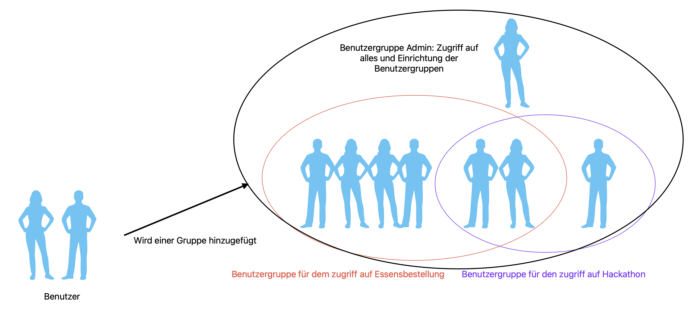
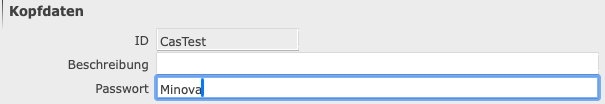
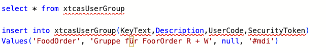
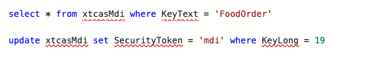
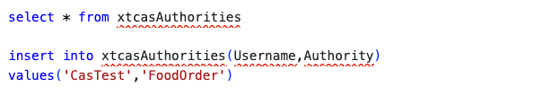
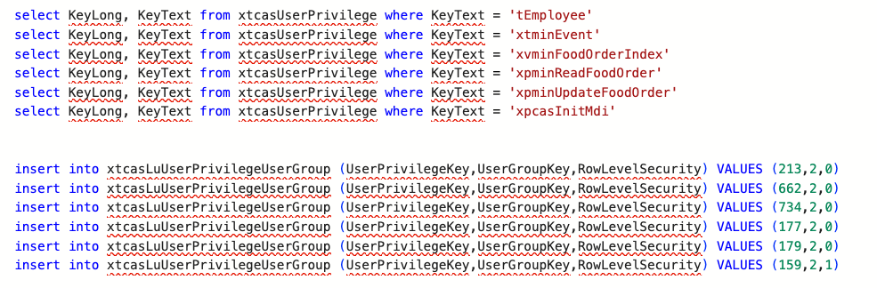

# Rechteverwaltung CAS-WFC über die SQL-Datenbank

In dieser Dokumentation geht es darum, wie man beim CAS Benutzer anlegt und diesen dann Gruppen hinzufügt, um Rechte zu verwalten, ohne das WFC direkt zu benutzen. Aufgrund des 'Internal CAS Errors' gibt es oft Probleme mit Grid-Tabellen, was dazu führen kann, dass die Benutzer- und Rechteverwaltung leider nicht richtig funktioniert. Hierbei hilft der direkte Zugriff auf die Datenbank. Mit diesem können wir alle Benutzer im Sinne der Rechteverwaltung vollständig verwalten.

In dieser Benutzerverwaltung ist es möglich, verschiedenen Benutzern eine oder mehrere Benutzergruppen zuzuweisen. Diese Benutzergruppen haben unterschiedliche Rechte, die den Benutzern dann zugewiesen werden. Somit können verschiedene Benutzer in mehreren Gruppen sein und dementsprechend unterschiedliche Rechte haben. Hier eine Grafik zur vereinfachten Darstellung:

Es ist leider nicht möglich, in der Datenbank direkt Benutzer über SQL anzulegen. Dafür benötigt man mindestens einen Admin, der Zugriff auf ein funktionierendes WFC hat. Dieser muss dann im Menü "Benutzer über DB Tabelle" einen Benutzer anlegen. Die **ID** ist in dem Fall der Benutzername, mit dem sich der Benutzer einloggt, und das **Passwort** ist immer der entsprechenden **ID** zugewiesen.

Als nächstes kann man nun in den SQL-Teil übergehen. Dafür kann man eine IDE seiner Wahl nehmen, es muss nur möglich sein, sich mit der entsprechenden Datenbank zu verbinden. Und so kann man nun eine Benutzergruppe anlegen. Diese kann beliebig heißen, benötigt werden ein **KeyText** und ein [**SecurityToken**](https://github.com/minova-afis/aero.minova.cas/blob/main/service/doc/adoc/security.adoc#securitytoken). Beim **SecurityToken** ist es wichtig, dass ein **'#'** davor steht, wie hier zu sehen:

Als kleinen Zwischenschritt navigiert man nun zu **xtcasMdi** und ändert dort den **SecurityToken** zum gleichen wie bei der **xtcasUserGroup** einen Schritt zuvor. Das **'#'** wird hierbei nicht benötigt. Diese Änderung ist wichtig, damit die jeweilige Benutzergruppe auch die Maske sehen kann.

Danach muss nur noch der jeweilige Benutzer zur Benutzergruppe hinzugefügt werden. Dies macht man, indem man die **xtcasAuthorities** Tabelle abfragt und dort dann den jeweiligen **UserName** und die Gruppe, welche dieser zugefügt werden soll, also der Authority, einträgt:

Der letzte Schritt ist, dass man den Benutzergruppen Prozeduren zuweist, welche dieser benutzen darf. Es ist sehr wichtig, dass überall die [**Rowlevelsecurity**](https://github.com/minova-afis/aero.minova.cas/blob/main/service/doc/adoc/security.adoc#row-level-security) auf **0** ist, außer bei **xpcasInitMdi**. Dort muss diese unbedingt auf **1** gestellt sein, da sonst für den jeweiligen Benutzer keine Masken angezeigt würden.

