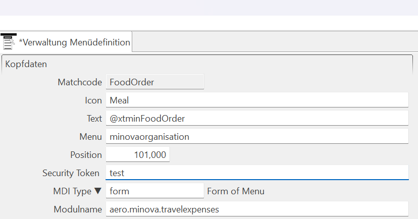

# In der WFC Anwendung
# 

Zuerst in der Maske Benutzergruppe die gewünschte Gruppe erstellen und einen Token mit '#' am Anfang eintragen. 

Die Gewünschten Tabellen und Prozeduren eintragen. Bei der MDI kann hier die Reihensicherheit 

# 

In der Maske Menü Verwaltung die zugeteilte Maske mit dem Security Token ohne '#' eintragen

In der Maske Verwaltung DB User, Benutzer Anlegen und den Gewünschten Gruppen Zuteilen.
