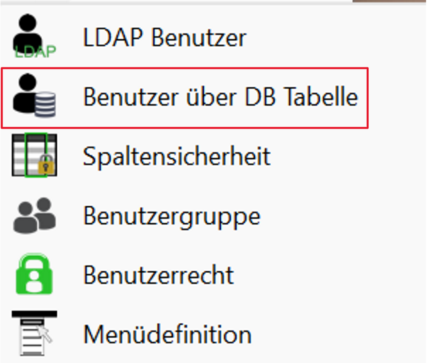
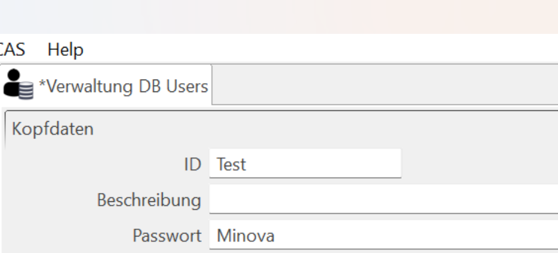
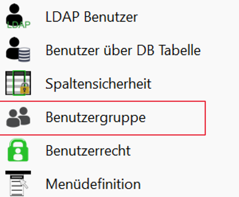
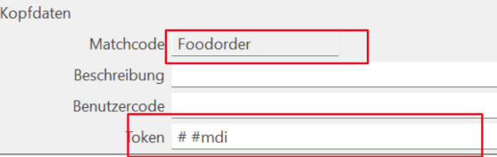
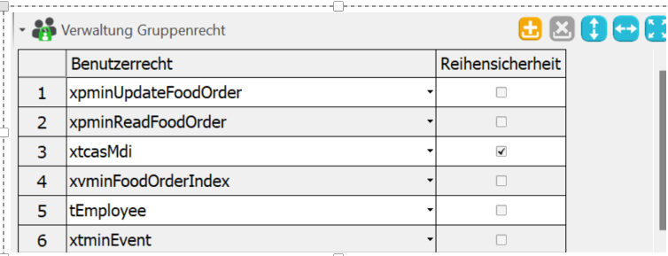
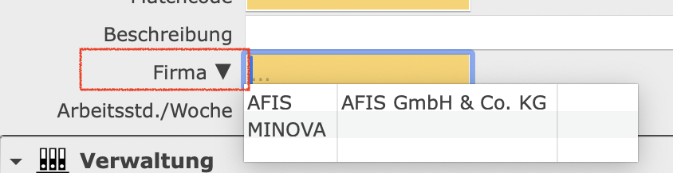
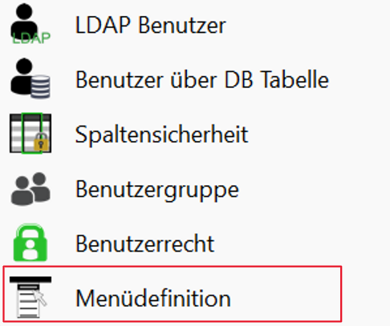
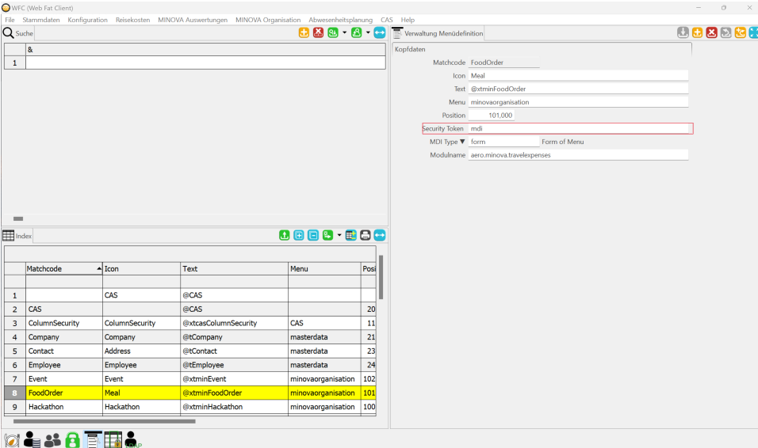

# CAS User Rechtsvergabe über WFC

Diese Dokumentation beschreibt den Vorgang und die Anpassungen die für die Einrichtung der Benutzerrechte notwenidg sind. 

Es ist möglich die Benutzer in unterschiedliche Benutzergruppen aufzuteilen. Dabei können den Gruppen jeweils andere Rechte zugewiesen werden.
Die Rechte beziehen sich auf das Durchführen eines bestimmten Prozesses: "Ändern eines Datensatze" oder auf das Anzeigen von unterschiedlichen Menus. Eine Benutzergruppe kann für bestimmte Menupunkte zugriff erhalten. Dies wird unter _Einschränkung auf das generelle Menu_ näher beschrieben.

## Benutzer Anlegen

Über den Menupunkt: CAS, kann in der Maske "Benutzer über DB Tabelle" ein neuer Benutzer angelegt oder ein existierender Benutzer geändert werden. 

_ID_ - eindeutiger Benutzername, dies kann auch eine Kennung z.B. "AB26" oder eine Nummer sein. 

_Beschreibung_ - Beschreibung des Benutzers, in der Regel der volle Name des Benutzers oder eine kurze Beschreibung der Tätitkeit. 

_Passwort_ - Das Passwort des Benutzers. Nach der Eingabe des Passwortes wird das Passwort beim Speichern verschlüsselt und ist danach nicht mehr lesbar. 

Das Zurücksetzen des Passwortes erfolgt auschließlich durch eine Neueingabe! Dies sollte durch einen Administrator durchgeführt werden. 

## Benutzergruppe Anlegen

Zum Erstellen einer Benutzergruppe muss im Menü CAS die Maske Benutzergruppe navigiert werden.

Die entsprechenden Felder sollten sinnvoll gefüllt werden.

_MatchCode_ - Name der Gruppe, dieser muss eindeutig sein. 

_Beschreibung_ - Beschreibung der Benutzergruppe, in der Regel eine kurze Beschreibung der Tätitkeit oder des Aufgabenbereichs.

_Benutzercode_ - Erstmal noch keine Verwendung. Wird nicht gefüllt.

_Token_ - Der Benutzertoken, mit dem die Rechte für unterschiedlich Prozesse eingerichtet werden sollen. Es können auch mehrere Token angegeben werden, diese trennt man mit dem '#'-Symbol.

### Rechte zuweisen

In der Benutzergruppe können den Gruppen Rechte auf Tabellen, Prozeduren oder Views zugewiesen werden. Dabei kann auch die 
[Reihensicherung](https://github.com/minova-afis/aero.minova.cas/blob/main/service/doc/adoc/security.adoc#tabellenzugriffserlaubnis:~:text=Methoden%20weiter%20gereicht.-,Row%2DLevel%2DSecurity,-Da%20jeder%20User) aktiviert werden.

*Prozeduren* Sie beschreiben eine bestimmte Funktion wie zum Beispiel das Hinzufügen, das Aktualisieren, Lesen oder Löschen eines Datensatzes. Zusäztzlich können auch Prozesse wie "Buchen" abgebildet sein, die verschiedene Prozesse nacheinander abbilden. 

*Views* Eine View ist eine "Sicht" auf einen bestimmten Bereich. Damit ist gemeint, dass zum Beipsiel alle nicht gelöschten Produkte, Fahrzeuge oder Events angezeigt werden. 

*Table* Eine Tabelle enthält Daten auf der Datenbank. Das Recht auf eine Tabelle zuzugreifen braucht man, wenn die Werte aus einer Lookup (Komponente mit DropDown-Liste) geladen werden müssen.

In diesem Beispiel braucht der Benutzer das Recht für die Tabelle "tCompany" damit beim Lesen, Erfassen oder Andern eines Datensatzes auf die verschiedenen Einträge aus der Tabelle zugegriffen werden kann. 

## Einschränkung auf das generelle Menu

Im Menü CAS kann die Menudefinition geöffnet werdern. In dieser Maske wird definiert, wie das Menu aussieht, und welche Masken zu den Menupunkten gehören. 

_Matchcode_ - eindeutiger Name des Menueintrags

_Icon_ - Name des Icons für das entsprechende Menu. Achtung für den MDI Typ: "menu" wird kein Icon benötigt.

_Text_ - Text, der angezeigt werden soll. Dieser entspricht dem Menu oder der Maske. Achtung, bei zu übersetzenden Properties muss die entsprechende Propertie mit einem angeführten "@" erfasst werden. 

_Menu_ - Verweis aus ein existierendes Menu, damit diese Maske sich in dem Menu einfügt

_Position_ - Gibt an an welcher Stelle innerhalb des Unter- oder Hauptmenus dieser Eintrag eingetragen wird. Es können Fließkommawerte eingetragen werden. 

_Security Token_ - Über die definierten [Security Tokens](https://github.com/minova-afis/aero.minova.cas/blob/main/service/doc/adoc/security.adoc#securitytoken:~:text=vom%20CAS%20haben.-,SecurityToken,-Jeder%20User%20erh%C3%A4lt) aus der Benutzergruppe können Rechte eingetragen werden. Dafür ist es wichtg, dass die Gruppen denen nur bestimmte Menus angezeigt werden sollen immer ein gülteiger Token zugewiesen ist.

_MDI Type_ - Es gibt 3 unterschiedliche Typen: application (Oberstes Menupunkt, der Pro Anwendung einmal existiert), menu (Menupunkt, wie "CAS", "Stammdaten", .. um die Masken zu sortieren, from (Maske mit Funktion).

_Modulname_ - Name des Moduls aus dem die entsprechende Maske stammt oder das Menu stammt.

Menupunkt ohne Security Token werden nur dann für den Benutzer sichtbar, wenn dieser das Recht hat mindestens eine Maske aus dem entsprechende Menu zu sehen. Andernsfalls ist der Menupunkt nicht sichtbar. 

